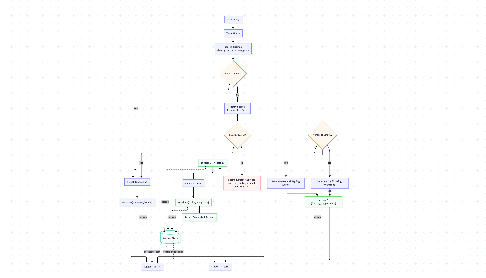

# FitFindr — planning.md

---

## Tools

### Tool 1: search_listings

Searches the secondhand listings dataset for items that match the user's description,
size, and price constraints. Results are ranked using keyword overlap between the query 
and listing metadata.

**Input parameters:**

- `description` (str): Keywords describing the user's desired item
- `size` (str | none): Desired clothing size. If none, no size filtering is applied.
- `max_price` (float | none): Maximum acceptable price. If none, no price filtering is applied.

**What it returns:**

Returns a list of listing dictionaries sorted by relevance score. Each listing contains:
- `id` (str):
- `title` (str):
- `description` (str):
- `category` (str):
- `style_tags` (list[str]):
- `brand` (str | none):
- `size` (str):
- `condition` (str):
- `price` (float):
- `colors` (list[str]):
- `platform` (str):

**What happens if it fails or returns nothing:**

Returns an empty list. The planning loop will attempt a fallback search with relaxed constraints before
ending the interaction.

---

### Tool 2: suggest_outfit

**What it does:**

Uses the selected listing and the user’s wardrobe to generate one or more outfit suggestions.

**Input parameters:**
- `new_item` (dict): Listing selected by the search tool.
- `wardrobe` (dict): User wardrobe containing an items list.

**What it returns:**

Returns a string containing one or more complete outfit recommendations that combine the selected item with wardrobe 
pieces and explain the overall style aesthetic.

**What happens if it fails or returns nothing:**

If the wardrobe is empty, the tool generates general styling advice instead of specific wardrobe
combinations.

---

### Tool 3: create_fit_card

**What it does:**

Generates a short social-media style caption for the selected item and outfit.

**Input parameters:**

- `outfit` (str): Outfit recommendation produced by suggest_outfit().
- `new_item` (dict): Selected listing.

**What it returns:**

Returns a 2–4 sentence social-media style caption that references 
the selected item, price, platform, and overall outfit vibe.

**What happens if it fails or returns nothing:**

Returns a descriptive error message indicating that outfit information is missing.

---

### Additional Tools (if any)

### Tool 4: compare_price

**What it does:**

Analyzes whether the selected listing is fairly priced by comparing it against similar listings in the dataset.

**Input parameters:**

- `item` (dict): The selected listing returned by search_listings().
- `all_listings` (list[dict]): Complete listings dataset.

**What it returns:**

Returns a string containing:
- Average price of comparable items
- Difference from average
- Recommendation (good deal, fair price, overpriced)

**What happens if it fails or returns nothing:**

If no comparable listings are available, the tool returns a message stating that a price comparison could not be performed.

---

## Planning Loop

**How does your agent decide which tool to call next?**

1. Parse the user’s query into description, size, and max_price.
2. Call search_listings().
3. If no results are found:
    * Retry without the size filter.
4. If results are still empty:
    * Set session[“error”] and stop.
5. Select the highest ranked listing.
6. Store it in session[“selected_item”].
7. Call suggest_outfit().
8. Store the result in session[“outfit_suggestion”].
9. Call create_fit_card().
10. Store the result in session[“fit_card”].
11. Call compare_price().
12. Store the result in session[“price_analysis”].
13. Return the completed session.

If search_listings returns no results, the agent automatically retries with relaxed constraints by removing the size filter before terminating.

---

## State Management

**How does information from one tool get passed to the next?**

The agent stores all information in a session dictionary.

Important state variables:

* query
* parsed
* search_results
* selected_item
* wardrobe
* outfit_suggestion
* fit_card
* price_analysis
* error

The session dictionary acts as the single source of truth for the entire interaction. Every tool reads from 
and writes to the same session object.
The selected item returned by search_listings is stored in session[“selected_item”] and passed directly into 
suggest_outfit(). The outfit suggestion is stored in session[“outfit_suggestion”] and passed directly 
into create_fit_card(). This prevents the user from re-entering information and demonstrates state 
persistence across tool calls.

---

## Error Handling

For each tool, describe the specific failure mode you're handling and what the agent does in response.

| Tool            | Failure mode                          | Agent response                                                                                                                                                                                                           |
|-----------------|---------------------------------------|--------------------------------------------------------------------------------------------------------------------------------------------------------------------------------------------------------------------------|
| search_listings | No results match the query            | Retry the search without the size filter. If no matches are found  after the retry, set session["error"] and return: “No matching listings were found. Try a broader description, different size, or higher budget.” |
| suggest_outfit  | Wardrobe is empty                     | Generate general styling advice for the selected item instead of referencing wardrobe pieces. Continue the workflow normally.   |
| create_fit_card | Outfit input is missing or incomplete | Return a descriptive message such as “Unable to generate fit card because no outfit suggestion was available.” Do not crash the application. |
| compare_price   | No comparable listings exist          |Return “Not enough comparable listings available to estimate price fairness.” and continue the workflow.|

---

## Architecture

---

## AI Tool Plan

**Milestone 3 — Individual tool implementations:**

I will use ChatGPT to implement each tool independently.
For search_listings, I will provide the Tool 1 specification including inputs, return values, ranking strategy,
and failure behavior. I expect ChatGPT to generate a filtering and scoring function using load_listings(). I will
verify correctness by testing multiple search queries and checking that results are ranked appropriately.
For suggest_outfit, I will provide the Tool 2 specification and wardrobe schema. I expect ChatGPT to generate Groq
API prompts that use wardrobe items when available and general styling advice when the wardrobe is empty. I will test both cases.
For create_fit_card, I will provide the Tool 3 specification and caption requirements. I expect ChatGPT to generate a 
prompt that produces short social-media captions. I will verify that captions contain the item name, price, and platform.
For compare_price, I will provide the Tool 4 specification and expect ChatGPT to generate comparison logic using similar listings.

### Milestone 4 — Planning Loop and State Management

I will provide ChatGPT with the Planning Loop section, State Management section, and Architecture Diagram.
I expect ChatGPT to generate the run_agent() implementation.
Before using the generated code, I will verify that:

- search_listings is called first
- empty search results terminate the workflow
- selected_item is stored in session state
- outfit_suggestion is stored and reused
- fit_card is generated from outfit_suggestion
- compare_price executes only after a successful search
- state is passed between tools without requiring user re-entry

---

## A Complete Interaction (Step by Step)

Example user query:

"I'm looking for a vintage graphic tee under $30. I mostly wear baggy jeans and chunky sneakers. 
What's out there and how would I style it?"

### Step 1

The agent parses the query and extracts:

- description = "vintage graphic tee"
- size = None
- max_price = 30

The agent calls:

search_listings("vintage graphic tee", None, 30)

### Step 2

search_listings returns several matching items.

The highest ranked result is:
"Vintage Band Tee — Faded Grey"

The listing is stored in:

session["selected_item"]

### Step 3

The agent calls:

suggest_outfit(
    session["selected_item"],
    session["wardrobe"]
)

The wardrobe contains baggy jeans, chunky sneakers, and a denim jacket.
The tool generates a complete outfit recommendation.
The result is stored in:

session["outfit_suggestion"]

### Step 4

The agent calls:

create_fit_card(
    session["outfit_suggestion"],
    session["selected_item"]
)

A social-media style caption is generated and stored in:

session["fit_card"]

### Step 5

At this point the session contains:
- selected_item
- outfit_suggestion
- fit_card
- price_analysis

which demonstrates state persistence across multiple tool calls.

The agent calls:

compare_price(
    session["selected_item"]
)

The tool determines whether the item is a good deal compared to similar listings.

The result is stored in:

session["price_analysis"]

### Final Output to User

The user sees:

- Top listing found
- Outfit recommendation
- Shareable fit card
- Price analysis
